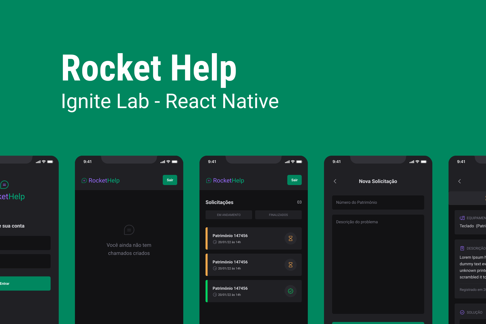

<h1 align="center">
  
</h1>

  
   

  <a href="#-Technologies">Technologies</a>&nbsp;&nbsp;&nbsp;|&nbsp;&nbsp;&nbsp;
  <a href="#-Project">Project</a>&nbsp;&nbsp;&nbsp;|&nbsp;&nbsp;&nbsp;
  <a href="#-Improvements">Improvements</a>

 

  

  

## 🚀 Technologies

This project was developed with the following technologies:

- React Native
- Firebase
- Firebase Auth
- Firebase FireStore with Real Time Updates
- Expo Bare Workflow
- TypeScript
- Native Base

## 💻 Project

RocketHelp is an interaction app through tickets, it is possible to create a request for IT support with the description of the problem and which equipment needs attention and the employee in possession of a password can manage these tickets and mark them as resolved .

This mobile application was created with a base structure of React Native, Expo Bare Workflow, Typescript and native base to create interfaces with productivity and has Firebase integration and the use of Cloud Firestore for the database in real time.

## 🛠 Improvements

The project was made following the tutorial provided by Rocketseat and at the end of the process some changes were made in order to improve the project by adding new features.

So far:

- Construction of a new screen for registering a new user;
- Updating the routes to compose the registration of new users.

To be applied:

- Activation and color change of the dark mode button;
- Consolidation of unique tickets for different users.

---

Made with ♥ by Doug Moreira and Rocketseat :wave: [Join our community!](https://discordapp.com/invite/gCRAFhc)
