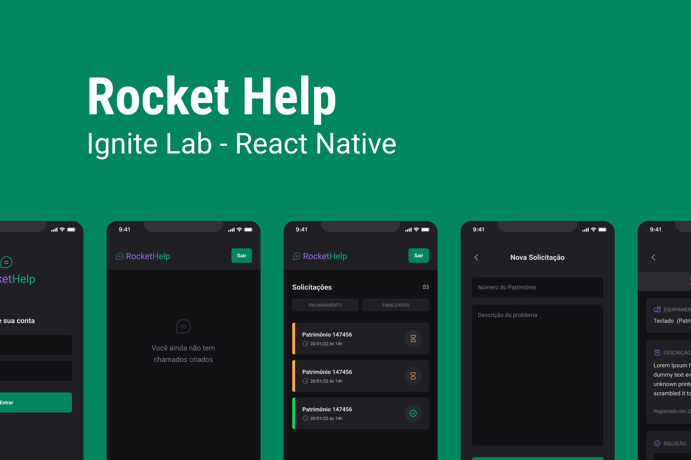

<h1 align="center">
  
</h1>

  
   

  <a href="#-tecnologias">Tecnologias</a>&nbsp;&nbsp;&nbsp;|&nbsp;&nbsp;&nbsp;
  <a href="#-projeto">Projeto</a>&nbsp;&nbsp;&nbsp;|&nbsp;&nbsp;&nbsp;
  <a href="#-Melhorias">Melhorias</a>

 

  

## 🚀 Tecnologias

Esse projeto foi desenvolvido com as seguintes tecnologias:

- React Native
- Firebase
- Expo Go
- NodeJS
- TypeScript
- Native Base

## 💻 Projeto

O RocketHelp é uma app de interação através de chamados, sendo possível criar uma solicitação para o suporte de TI com a descrição do problema e qual o equipamento que precisa de atenção e o funcionário em posse de uma senha pode gerenciar essas chamados e marcar como resolvidos.

Essa aplicação mobile foi criada com uma estrutura base de React Native, Expo Bare Workflow, Typescript e base nativa para criar interfaces com produtividade e tem integração do Firebase e o uso do Cloud Firestore para o banco de dados em tempo real.

## 🛠 Melhorias

O projeto foi feito seguindo o tutorial provido pela Rocketseat e ao final do processo todo foram feitas algumas alterações com o intuito de melhorar o projeto adicionando novas funcionalidades.

Até o momento:

- Construção de uma nova tela para cadastramento de um novo usuário;
- Atualização das rotas para compor o cadastramento de novos usuários.

A ser aplicado:

- Ativação e mudança de cores do botão de dark mode;
- Consolidação dos chamados únicos para usuários diferentes.

---

Feito com ♥ by Doug Moreira e Rocketseat :wave: [Participe da nossa comunidade!](https://discordapp.com/invite/gCRAFhc)
